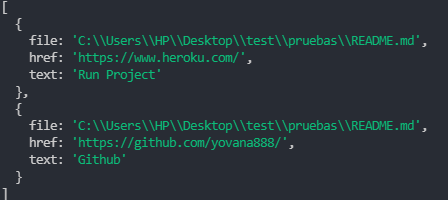
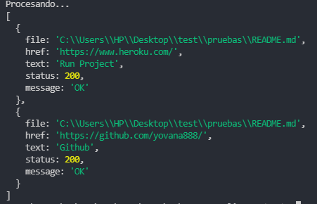
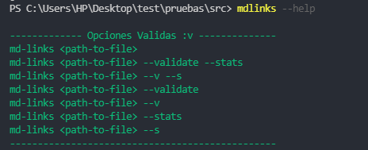
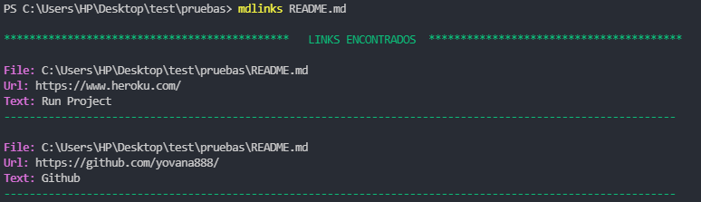

# Markdown Links

## Índice

* [1. ¿Que es Md-Links?](#1-que-es-md-links)
* [2. Diagrama de Flujo](#2-diagrama-de-flujo)
* [3. Instalación](#3-instalación)
* [4. Herramientas utilizadas de librería](#4-herramientas-utilizadas)
* [5. Uso de la librería](#5-uso-de-la-librería)
* [6. Ejemplos de funcionalidad de la librería](#5-ejemplos-de-funcionalidad-de-la-librería)

***

## 1. ¿Que es Md-Links?

Markdown Links es una librería de Node.js que nos permite buscar en un directorio todos los archivos con extension (.md) y a partir de ello mostrar todos los links por cada archivo, asi mismo se podra validar el status de cada uno de ellos.

## 2. Diagramas de Flujo:pencil2:

   ### Para la Librería
   [Para la Librería: md-links](src/img/md_links.jpg)

   ### Para el CLI
   [Para el cli](src/img/cli.jpg)

## 3. Instalación :rocket:

- [ ] Para instalar la librería a modo global debe ejecutar el siguiente comando: `npm install -g mdlinks-yok`

- [ ] Alternativamente para instalar el paquete con fines de desarrollo: `npm install --save-dev  mdlinks-yok`

- [ ] Para Corroborar que la libreria es parte de nuestras dependencias ejecutar: `npm list --depth 0`

## 4. Herramientas Utilizadas 	:black_nib:

La librería contiene las siguientes dependencias:
* Node.js
* Node-fetch
* Chalk

## 5. Uso de la librería :package:

- [ ] Para hacer uso de la librería, debes importarla dentro de tu archivo principal de extensión .js de la siguiente manera:
    ```js
    const { mdLinks } = require('mdlinks-yok');
    mdLinks("../README.md", { validate: true })
        .then(response => {
            console.log(response);
        })
        .catch(error => {
            console.log(error);
        });
    ```

- [ ] Argumentos que recibe mdLinks
    - path : Ruta absoluta o relativa al archivo o directorio. (ej. "../README.md")
    - option: Un objeto con la propiedad validate, donde puede ser true o false 

- [ ] Para poder visualizar el resultado ejecute desde su terminal `node <ejemploArchivo.js>` 
    - validate:false

      

    - validate:true

      

## 6. Uso del CLI :package:
  El ejecutable de nuestra aplicación debe poder ejecutarse de la siguiente manera a través de la terminal: `md-links <path-to-file> [options]`

  :white_check_mark:  Option: `mdlinks help`
    
  
  :white_check_mark:  Option: `mdlinks <path-to-file>`
    
