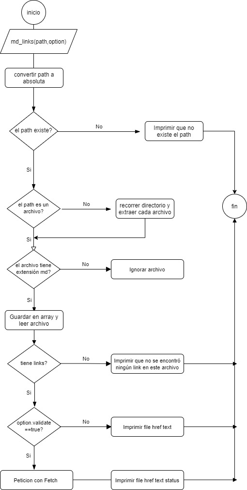
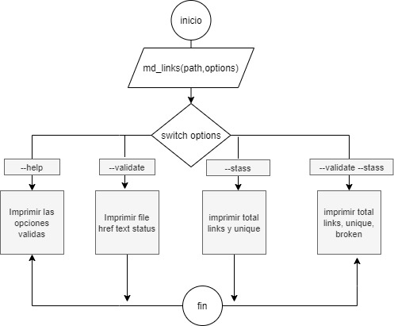

# Markdown Links

## Índice

* [1. ¿Que es Md-Links?](#1-que-es-md-links)
* [2. Diagrama de Flujo](#2-diagrama-de-flujo)
* [3. Instalación](#3-instalación)
* [4. Herramientas utilizadas de librería](#4-herramientas-utilizadas)
* [5. Uso de la librería](#5-uso-de-la-librería)
* [6. Ejemplos de funcionalidad de la librería](#5-ejemplos-de-funcionalidad-de-la-librería)

***

## 1. ¿Que es Md-Links?

Markdown Links es una librería de Node.js que nos permite buscar en un directorio todos los archivos en formato Markdown (.md) y a partir de ello mostrar todos los links como tambien se podra validar el status de cada uno de ellos.

## 2. Diagramas de Flujo:pencil2:

### Para la Librería

### Para el CLI

## 3. Instalación :rocket:

Para instalar la librería debes correr el siguiente comando:
#### `npm install md-links-yvc`

## 4. Herramientas Utilizadas 	:black_nib:

La librería contiene las siguientes dependencias:
* Node.js
* Node-fetch
* Chalk

## 5. Uso de la librería :package:
Para hacer uso de la librería, debes importarla dentro de tu archivo principal de extensión .js de la siguiente manera:
#### `const mdLinks = require('cep-md-links');`

Aparte del análisis básico del archivo, la librería ofrece 2 opciones o argumentos para entregar la validación y estadística de los links contenidos.
#### `mdLinks('path', {options});`

###### Argumentos:
* `path`: El archivo .md
* `options`: Recibe un objeto con dos propiedades, "validate" y "stats". 

La librería te ofrece la siguiente información:

* Nombre del archivo .md
* Total de links encontrados en el archivo.
* URL encontrada, el texto asociado al link y la ruta o file donde se encuentra el link.
* Lista de links con su url, status, el texto y archivo .md donde se encuentra.
* Total de links, total de links únicos y total de links rotos o no funcionales

## 6. Ejemplos de funcionalidad de la librería :memo:

Dependiendo de las opciones entregadas en la terminal, la librería ofrece diferentes datos de tus archivos .md.

Puedes hacer uso de esta libreria a traves de las siguientes instrucciones:

* **Sin opciones:** debes ejecutar la librería de la siguiente manera a traves de la terminal:

#### `node <<archivo.js>> <<archivo.md>>`

 * **Opción validate:** ejecutar en la consola el siguiente comando:

#### `node <<archivo.js>> <<archivo.md>> <<options>>`

**options** equivale a **--validate** o **--v**

* **Opción stats:** ejecutar en la consola el siguiente comando:

#### `node <<archivo.js>> <<archivo.md>> <<options>>`

**options** equivale a **--stats** o **--s**

* **Opción validate + stats:** ejecutar en la consola el siguiente comando:

#### `node <<archivo.js>> <<archivo.md>> --v --s`  
o
#### `node <<archivo.js>> <<archivo.md>> --s --v` 

## 7. Licencia :busts_in_silhouette:

Este proyecto fue realizado por:
* 💻 [Yovana Velasquez](https://github.com/yovana888), 
